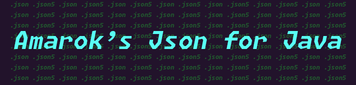

<center>




[](./LICENSE.txt)
[](https://jitpack.io/#AmarokIce/AmarokJsonForJava)

</center>

# Amarok 's Json For Java

## 这是什么
Amarok's Json For Java 是一个基于 Java 编写的 Json 解析库，能够较为准确的处理 Json 并内部推断 Json 取得的类型。

解析 Json，Json5，以及写入到 Json 与 Json5！

## 为什么选择这个而不是其他Json处理库
**Google Gson** ： Gson 很好！但是 Gson 有时候会错误的处理类型推断，而直接使用 JsonObject 处理时容易陷入类型不可知的麻烦之中。大部分情况下这没有问题，但是我在编写一些基于 Json 解析的内容的时候迫切的需要知道用户是否输入了正确的类型并对类型进行预推断，抛出正确的错报。不断的尝试检查只会增加运行时的性能开销，给用户一种“这个软体很卡”的感受，因此我认为类型推断应该在解析时就完成。

这么做可能会让解析速度变慢，但是这是等价的。而且Gson貌似依然不能处理Json5.

**Jackson** : Jackson 确实是我最好的选择！不仅很快，也能处理 Json5！我在应对一些私人项目时除了 Gson 也会优先考虑 Jackson。

但是 Jackson 的大小让我的打包后程序显得很臃肿。在一些被要求更轻的软体中，我会再去尝试考虑其他的库。

**FoxSuma Json for Java** : 我将其打包在了我的 Minecraft Mod Lib 中，因为这个库很炫酷（它支持 Json5 的处理！），但是它闻起来有些个人项目化，与 Gson 一样容易陷入类型不可知的麻烦中。应该说，持续持有一个 JsonNode 的数据类型而不是通过内部推断（或依赖大脑）是更好的选择。

## 让我们开始

### Gradle

[Github Package](https://github.com/AmarokIce/AmarokJsonForJava/packages/1929112)

```groove
repositories {
    maven {
        url 'http://maven.snowlyicewolf.club/'
        allowInsecureProtocol = true
    }
}

dependencies {
    implementation "club.someoneice.json:amarok-json-for-java:1.4"
}
```

### 从Json解析

准备 Json 文件，或字符串，然后取得 [JSON](src/main/java/club/someoneice/json/JSON.java) 类即可开始。此处的Json与Json5的解析器内部实现基本相同，但是 Json5 的读取会比 Json 读取稍慢一些。

```java
JSON json = JSON.json;
JSON json5 = JSON.json5;
```

通过parse方法取得 JsonNode 实例：
```java
// 通常可以直接转型为MapNode或ArrayNode。
JsonNode node = json.parse(file);

ArrayNode arrayNode = json.tryPullArrayOrEmpty(node);
MapNode mapNode = json.tryPullObjectOrEmpty(node);
```

> 预设的JsonNode类型有 <br />
> Null, String, Int, Float, Double, Boolean, Map, Array, Number, Long, Other

JsonNode 可以直接取出内部的内容，也可以通过 Node 的内部推断来获取类型：
```java
JsonNode node = JsonNode.NULL;
System.out.println(node.getType());
// 输出Null，这是空类型的Node
```

### 格式化到Json

[JsonBuilder](src/main/java/club/someoneice/json/processor/JsonBuilder.java):
通过 'JsonBuilder#asString(JsonNode) -> String' 方法可以从 JsonNode 到 String。而通过方法 'JsonBuilder#prettyPrint' 可以格式化的打印 Json。

[Json5Bean](src/main/java/club/someoneice/json/processor/Json5Builder.java)
Json5Bean 允许使用流输入与注解输入，需要先实现 Json5Builder 后取得 ArrayBean 与 MapBean 开始输入任务流。
```java
public class Main {
    public static void main(String[] args) {
        File file2 = new File("./NewJsonFile.json5");
        if (!file2.exists() || !file2.isFile()) file2.createNewFile();
        // 创建核心构建器
        Json5Builder builder = new Json5Builder();
        
        // 添加一个 Array 构建器
        Json5Builder.ArrayBean arrayBean = builder.getArrayBean();
        
        // 添加一个 Map 构建器
        Json5Builder.ObjectBean mapBean = builder.getObjectBean();

        arrayBean.add(new StringNode("Test"));
        // 没错，你可以换行！
        arrayBean.enterLine();
        arrayBean.add(new StringNode("This is another Test"));
        
        mapBean.put("test", new StringNode("Test"));
        // 你可以为你的 Json5 添加注解
        mapBean.addNote("This is a test note");
        mapBean.put("newTest", new StringNode("This is another Test"));

        MapNode map = new MapNode();
        map.put("testInMap", new StringNode("mapTest"));
        // 向 Map 封装一个 Map
        mapBean.put("nodeMap", map);

        // 在把 Map 构建器封装进Array构建器
        arrayBean.addBean(mapBean);

        // 推送构建任务
        builder.put(arrayBean);
        // 导出 Json String 内容
        String data = builder.build();
        
        // 现在可以检查一下
        System.out.println(data);

        // 然后输出到我们的文本
        OutputStream outputStream = Files.newOutputStream(file2.toPath());
        outputStream.write(data.getBytes());
        outputStream.close();
    }
}
```